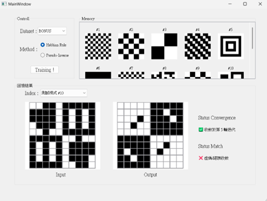
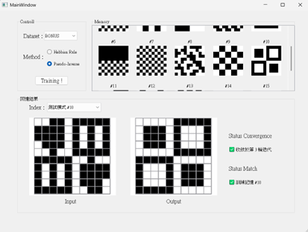

# Hopfield Network 聯想記憶影像修復系統

> **類神經網路專案實作**：基於 Hopfield Network 原理，實現噪點影像的自動修復與關聯回想。

本專案實作了一個具備圖形介面的聯想記憶系統，除了基礎的 Hebbian Rule 訓練外，更引入了 **Pseudo-Inverse** 來解決記憶容量受限與干擾問題，成功實現對高噪點圖形的精準修復。

## 技術亮點
* **演算法實作**：從底層矩陣運算實作 Hopfield 網路，包含 Weight Matrix Calculation 與 Asynchronous Update。
* **雙訓練模式**：
  * **Hebbian Rule**：基礎訓練模式，展示生物神經元學習機制。
  * **Pseudo-Inverse**：強化模式，大幅提升記憶容量並消除模式間的線性依賴干擾。
* **GUI 互動介面**：使用 PyQt 建立視覺化工具，支援即時調整參數並觀察網路收斂過程。

## 實驗結果與分析

### 1. 影像修復展示
在此專案中，系統能成功將帶有高度隨機噪點的輸入影像，還原為儲存於網路中的原始記憶模式。

*圖 1：Hebbian Rule 對於噪點影像之修復結果對照*

*圖 2：Psuedo Inverse 對於噪點影像之修復結果對照*

### 2. 演算法效能對比 (Hebbian vs. Pseudo-Inverse)
根據實驗觀測，當記憶模式數量增加時：
* **Hebbian Rule**：容易受模式間干擾影響，產生**Spurious States**，導致網路收斂於非目標狀態。
* **Pseudo-Inverse**：能有效消除線性依賴項，即便在模式數量較多（如 BONUS 資料集）的情況下，仍能達到 100% 的正確匹配。

## 開發環境與工具
* **語言**：Python 3.11
* **核心庫**：NumPy (矩陣運算)
* **介面**：PyQt / UI Designer
* **數據處理**：自定義data loader，處理 9x12 與 10*10 的二進位圖形數據

## 資料夾結構說明
* `hopfield_core.py`: 聯想記憶網路核心邏輯與演算法
* `hopfield_gui.py` & `hopfield.ui`: 系統介面與互動邏輯
* `data_utils.py`: 資料預處理與檔案格式解析
* `Report.pdf`: 包含完整的數學推導、收斂軌跡圖及深入的心得分析

## 完整技術報告
關於Energy Function的收斂分析與更詳盡的測試數據，請參閱 [完整書面報告](./Report.pdf)。

---
**開發心得**：
透過這個專案，我深刻體會到統計背景在理解 Weight Matrix 與線性代數優化上的優勢，特別是 Pseudo-Inverse 的引入，讓我觀察到數學模型如何實質解決機器學習中的容量問題。
